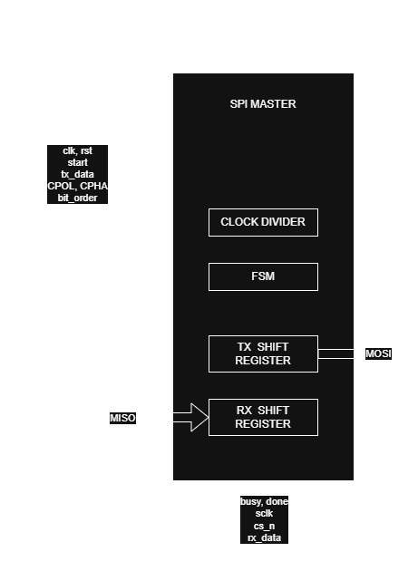
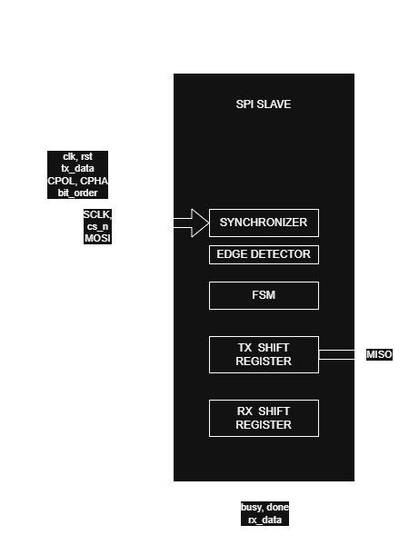

# SPI SV Core Architecture

## 1. Design Overview

The SPI SV Core follows a modular architecture consisting of independent SPI Master and SPI Slave modules integrated through a top-level module for verification and system integration.

The design supports configurable data width, SPI operating modes, bit ordering, and master clock generation while maintaining a reusable and synthesizable RTL implementation suitable for both FPGA and ASIC targets.

Version 1 provides independent SPI Master and SPI Slave modules together with a top-level integration module for full-duplex communication, verification, synthesis, and timing analysis

---

## 2. Design Philosophy

The SPI SV Core is designed according to the following principles:

- Modular design
- Parameterization
- Reusability
- Synthesizable RTL
- Vendor-independent implementation
- Clear separation between datapath and control
- Documentation-driven development

The implementation avoids vendor-specific primitives wherever possible, allowing the same RTL to target FPGA and ASIC technologies through standard synthesis flows.

---

## 3. Module Hierarchy

```text
               spi_top
              /       \
             /         \
      spi_master    spi_slave
```

| Module | Description |
|---------|-------------|
| `spi_master` | Generates the SPI clock and controls SPI transactions. |
| `spi_slave` | Responds to SPI transactions initiated by the master. |
| `spi_top` | Integrates the master and slave modules for verification and system-level testing. |

---

## 4. Data Flow

### Master Transmit Path

```text
tx_data
   │
   ▼
SPI Master
   │
   ▼
MOSI
```

Parallel transmit data is serialized by the SPI Master and transmitted over the MOSI line.

### Slave Receive Path

```text
MOSI
   │
   ▼
SPI Slave
   │
   ▼
rx_data
```

Incoming serial data is received by the SPI Slave and reconstructed into parallel data.

### Slave Transmit Path

```text
tx_data
   │
   ▼
SPI Slave
   │
   ▼
MISO
```

Parallel transmit data is serialized by the SPI Slave and transmitted over the MISO line.

### Master Receive Path

```text
MISO
   │
   ▼
SPI Master
   │
   ▼
rx_data
```

Incoming serial data is received by the SPI Master and reconstructed into parallel data.

---

## 5. SPI Master

### Architectural Decisions

The SPI Master follows a synchronous single-clock architecture.

Key design decisions:

- Single clock domain
- Runtime configuration latching
- Parameterized clock divider
- Edge-based SPI protocol abstraction
- Independent transmit and receive shift registers
- Registered outputs
- Parameterized transfer width
- Four-state transaction FSM

### Datapath Overview

The SPI Master datapath consists of:

- Clock divider
- Edge generation logic
- Transaction FSM
- Transmit shift register
- Receive shift register
- Bit counter
- Registered outputs



### Internal Registers

| Register | Purpose |
|----------|---------|
| `cpol_reg` | Latched clock polarity |
| `cpha_reg` | Latched clock phase |
| `bit_order_reg` | Latched bit order |
| `tx_shift_reg` | Transmit shift register |
| `rx_shift_reg` | Receive shift register |
| `clk_div_counter` | Clock divider counter |
| `bit_count` | Bit counter |
| `mosi_reg` | Registered MOSI output |
| `sclk_reg` | Registered SPI clock output |
| `cs_n_reg` | Registered chip-select output |
| `busy_reg` | Busy status |
| `done_reg` | Transfer complete pulse |

---

## 6. SPI Slave

The SPI Slave follows a synchronous single-clock architecture.

Key design decisions:

- Single clock domain
- Two-stage synchronization of asynchronous SPI inputs
- Runtime configuration latching
- Edge-based SPI protocol abstraction
- Independent transmit and receive shift registers
- Registered outputs
- Parameterized transfer width
- Four-state transaction FSM

### Datapath Overview

The SPI Slave datapath consists of:

- Two-stage input synchronizers
- SCLK edge detection
- Transaction FSM
- Transmit shift register
- Receive shift register
- Bit counter
- Registered outputs



### Internal Registers

| Register                         | Purpose                       |
| -------------------------------- | ------------------------------|
| `cpol_reg` | Latched clock polarity |
| `cpha_reg` | Latched clock phase |
| `bit_order_reg` | Latched bit order |
| `tx_shift_reg` | Transmit shift register |
| `rx_shift_reg` | Receive shift register |
| `rx_data_reg` | Received data register |
| `bit_count` | Bit counter |
| `sclk_sync_ff1`, `sclk_sync_ff2` | Two-stage SCLK synchronizer |
| `cs_sync_ff1`, `cs_sync_ff2` | Two-stage CS synchronizer |
| `mosi_sync_ff1`, `mosi_sync_ff2` | Two-stage MOSI synchronizer |
| `sclk_sync` | Synchronized SCLK signal |
| `cs_sync` | Synchronized CS_N signal |
| `mosi_sync` | Synchronized MOSI signal |
| `sclk_prev` | Previous synchronized SCLK for edge detection |
| `miso_reg` | Registered MISO output |
| `busy_reg` | Busy status |
| `done_reg` | Transfer complete pulse |

---

## 7. Top-Level Integration

The `spi_top` module integrates the SPI Master and SPI Slave into a reusable verification platform.

The top-level module is responsible for:

- Instantiating the SPI Master and SPI Slave modules.
- Passing configuration parameters.
- Connecting the SPI interface signals (`MOSI`, `MISO`, `SCLK`, and `cs_n`).
- Providing a clean system interface for simulation and verification.

The top-level module contains no protocol-specific datapath or control logic.

The SPI Master generates the SPI interface signals (`MOSI`, `SCLK`, and `CS_N`), while the SPI Slave receives these synchronized signals and responds through the `MISO` line.

The top-level module contains no additional protocol logic. It simply connects the two modules together, making it suitable for system-level verification, synthesis, and timing analysis.

---

## 8. Future Architecture Extensions

Future versions of the SPI SV Core may include:

- Multi-chip-select SPI Master
- Multi-slave controller
- Multi-master arbitration
- Runtime-programmable clock divider
- FIFOs
- DMA support
- Interrupt generation
- APB wrapper
- AXI4-Lite wrapper
- Quad SPI (QSPI)
- Execute-In-Place (XIP)
- Asynchronous clock-domain support
- Formal verification