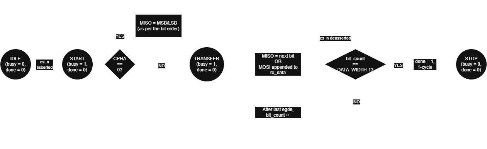
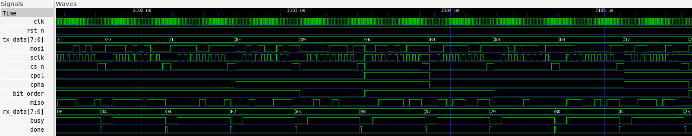
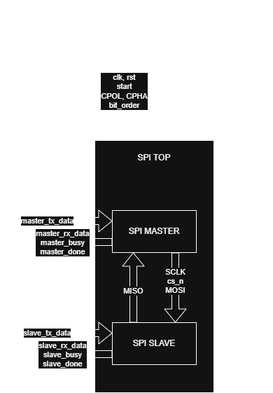
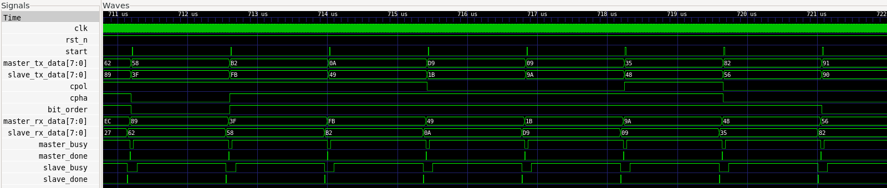

# SPI SV Core Implementation

## 1. Overview

This document describes the implementation details of the SPI SV Core.

It complements the project specification and architecture documents by documenting the RTL organization, coding style, implementation decisions, design trade-offs, synthesis results, and timing analysis throughout the development of the project.

---

## 2. Coding Guidelines

The SPI SV Core follows the implementation guidelines below:

- SystemVerilog is used throughout the project.
- Only synthesizable RTL constructs are used.
- Sequential logic is implemented using `always_ff`.
- Combinational logic is implemented using `always_comb`.
- Non-blocking assignments (`<=`) are used for sequential logic.
- Blocking assignments (`=`) are used for combinational logic.
- Enumerated types are used for finite-state machines where applicable.
- Parameters are validated during elaboration whenever possible.
- The design operates entirely within a single clock domain.
- Clock-enable signals are preferred over internally generated clocks where applicable.
- The design is fully parameterized wherever practical.

---

# 3. SPI Master

## 3.1 Module Overview

The `spi_master` module implements a synthesizable, parameterized SPI Master supporting full-duplex serial communication.

The design supports all four standard SPI operating modes through runtime-configurable clock polarity (`CPOL`) and clock phase (`CPHA`), runtime-selectable MSB-first and LSB-first transmission, parameterized transfer widths, and a parameterized clock divider for generating the SPI serial clock.

The implementation follows a synchronous single-clock architecture. All sequential logic operates on the rising edge of the system clock, while SPI protocol events are generated using internal edge-detection logic derived from the generated serial clock. Runtime configuration inputs are latched at the start of each transaction and remain unchanged until the transfer completes.

The module is fully synthesizable and vendor-independent, making it suitable for both FPGA and ASIC implementation flows.

## 3.2 Interface

### Parameters

| Parameter | Description |
|-----------|-------------|
| `DATA_WIDTH` | Number of bits transferred during each SPI transaction. |
| `CLOCK_DIV` | System-clock divider used to generate the SPI serial clock. |

### Inputs

| Signal | Width | Description |
|--------|------:|-------------|
| `clk` | 1 | System clock |
| `rst_n` | 1 | Active-low synchronous reset |
| `start` | 1 | Initiates a new SPI transaction |
| `tx_data` | `DATA_WIDTH` | Parallel transmit data |
| `miso` | 1 | Master In Slave Out |
| `cpol` | 1 | Runtime clock polarity selection |
| `cpha` | 1 | Runtime clock phase selection |
| `bit_order` | 1 | Runtime bit-order selection |

### Outputs

| Signal | Width | Description |
|--------|------:|-------------|
| `mosi` | 1 | Master Out Slave In |
| `sclk` | 1 | Generated SPI serial clock |
| `cs_n` | 1 | Active-low chip-select |
| `rx_data` | `DATA_WIDTH` | Received parallel data |
| `busy` | 1 | Indicates an active transaction |
| `done` | 1 | One-cycle transfer-complete pulse |

## 3.3 Derived Parameters

The SPI Master derives internal parameters from the user-specified configuration to simplify counter sizing while maintaining parameterized scalability.

| Parameter | Purpose |
|-----------|---------|
| `DIV_WIDTH` | Width of the SPI clock-divider counter, derived from `CLOCK_DIV`. |
| `BIT_CNT_WIDTH` | Width of the transfer bit counter, derived from `DATA_WIDTH`. |

The implementation validates the following parameter constraints during simulation:

- `DATA_WIDTH > 0`
- `CLOCK_DIV > 1`

Parameter validation is excluded from synthesis using `translate_off` directives while remaining active during simulation.

## 3.4 Internal Registers

The SPI Master maintains internal registers for runtime configuration, datapath operation, transaction control, and registered outputs.

| Register | Purpose |
|----------|---------|
| `cpol_reg` | Latched clock polarity for the current transaction. |
| `cpha_reg` | Latched clock phase for the current transaction. |
| `bit_order_reg` | Latched bit-order selection. |
| `tx_shift_reg` | Holds transmit data during serial shifting. |
| `rx_shift_reg` | Accumulates received serial data during a transaction. |
| `rx_data_reg` | Stores the completed received data after the transaction finishes. |
| `clk_div_counter` | Divides the system clock to generate the SPI serial clock. |
| `bit_count` | Tracks the number of transferred bits. |
| `mosi_reg` | Registered MOSI output. |
| `sclk_reg` | Registered SPI serial clock output. |
| `cs_n_reg` | Registered chip-select output. |
| `busy_reg` | Registered busy status. |
| `done_reg` | Registered transfer-complete indication. |

## 3.5 Combinational Signals

The SPI Master derives several combinational signals to simplify protocol implementation and reduce duplicated logic.

| Signal | Purpose |
|---------|---------|
| `toggle_now` | Indicates that the clock-divider counter has reached the programmed divide value. |
| `sclk_toggle` | Requests toggling of the generated SPI clock. |
| `sclk_rise` | Indicates a rising edge of the generated SPI clock. |
| `sclk_fall` | Indicates a falling edge of the generated SPI clock. |
| `sample_edge` | Indicates the SPI clock edge used for data sampling. |
| `shift_edge` | Indicates the SPI clock edge used for data shifting. |
| `transfer_finish` | Indicates that the final bit of the current transaction is being transferred. |
| `final_edge` | Indicates the final protocol event required to complete the transaction based on the selected SPI mode. |

The `sample_edge` and `shift_edge` signals are derived from the latched `CPOL` and `CPHA` configuration, allowing a single implementation to support all four SPI operating modes without duplicating datapath logic.

## 3.6 Datapath & State Machine

The SPI Master datapath consists of:

- Clock divider
- Edge generation logic
- Transaction FSM
- Transmit shift register
- Receive shift register
- Bit counter
- Registered outputs

The SPI Master uses a four-state finite-state machine.

| State | Function |
|--------|----------|
| `IDLE` | Waits for a new transaction |
| `START` | Initializes the transaction and latches the runtime configuration |
| `TRANSFER` | Performs full-duplex serial communication |
| `STOP` | Completes the transaction and returns to `IDLE` |


## 3.7 Algorithm

1. Validate configuration parameters.
2. Wait for a valid `start` request.
3. Latch the runtime configuration and transmit data.
4. Initialize internal registers and counters.
5. Assert `cs_n` and generate the SPI clock.
6. Shift transmit data and sample receive data according to the selected SPI mode.
7. Repeat until all bits have been transferred.
8. Store the received data.
9. Deassert `cs_n`.
10. Generate the transfer-complete indication.

## 3.8 Design Decisions

- Runtime configuration latched per transaction.
- Single clock domain.
- Parameterized SPI clock divider.
- Edge-based SPI protocol abstraction.
- Independent transmit and receive shift registers.
- Registered interface outputs.
- Runtime-selectable bit ordering.
- Compile-time parameter validation.

## 3.9 Corner Cases

| Condition | Behaviour |
|-----------|-----------|
| Invalid parameters | Simulation-time parameter validation failure |
| `start` while busy | Request ignored |
| Configuration change during transfer | Current transaction unaffected |
| `CPHA = 0` | First transmit bit preloaded |
| Reset | Controller returns to IDLE and clears internal registers |

## 3.10 Resource Utilization

### Synthesis Results

- Tool: Yosys
- Script: `scripts/synth_spi_master.ys`

| Metric | Value |
|--------|------:|
| Number of Ports | 14 |
| Number of Port Bits | 28 |
| Number of Wires | 158 |
| Number of Wire Bits | 395 |
| Public Wires | 47 |
| Public Wire Bits | 111 |
| Memory Blocks | 0 |
| Total Cells | 306 |

### Cell Breakdown

| Cell Type       | Count |
| --------------- | ----: |
| `$_AND_`        |    57 |
| `$_MUX_`        |   127 |
| `$_NOT_`        |    24 |
| `$_OR_`         |    56 |
| `$_SDFFE_PN0N_` |     3 |
| `$_SDFFE_PN0P_` |    35 |
| `$_SDFFE_PN1P_` |     1 |
| `$_XOR_`        |     3 |

### Waveform


### Verification Status

- [x] RTL Simulation
- [x] Self-checking Testbench
- [x] Assertions
- [x] Generic Synthesis
- [x] Static Timing Analysis

---

# 4. SPI Slave

## 4.1 Module Overview

The `spi_slave` module implements a synthesizable, parameterized SPI Slave supporting full-duplex serial communication.

The design supports all four standard SPI operating modes through runtime-configurable clock polarity (`CPOL`) and clock phase (`CPHA`), runtime-selectable MSB-first and LSB-first transmission, and parameterized transfer widths.

The implementation follows a synchronous single-clock architecture. External SPI interface signals (`SCLK`, `CS_N`, and `MOSI`) are synchronized into the system clock domain using dedicated two-stage synchronizers before protocol processing. Runtime configuration inputs are latched at the start of each transaction and remain unchanged until the transfer completes.

The module is fully synthesizable and vendor-independent, making it suitable for both FPGA and ASIC implementation flows.

## 4.2 Interface

### Parameters

| Parameter | Description |
|-----------|-------------|
| `DATA_WIDTH` | Number of bits transferred during each SPI transaction. |

### Inputs

| Signal | Width | Description |
|--------|------:|-------------|
| `clk` | 1 | System clock |
| `rst_n` | 1 | Active-low synchronous reset |
| `tx_data` | `DATA_WIDTH` | Parallel transmit data |
| `mosi` | 1 | Master Out Slave In |
| `sclk` | 1 | SPI serial clock |
| `cs_n` | 1 | Active-low chip-select |
| `cpol` | 1 | Runtime clock polarity selection |
| `cpha` | 1 | Runtime clock phase selection |
| `bit_order` | 1 | Runtime bit-order selection |

### Outputs

| Signal | Width | Description |
|--------|------:|-------------|
| `miso` | 1 | Master In Slave Out |
| `rx_data` | `DATA_WIDTH` | Received parallel data |
| `busy` | 1 | Indicates an active transaction |
| `done` | 1 | One-cycle transfer-complete pulse |

## 4.3 Derived Parameters

The SPI Slave derives internal parameters from the user-specified configuration to simplify counter sizing while maintaining parameterized scalability.

| Parameter | Purpose |
|-----------|---------|
| `BIT_CNT_WIDTH` | Width of the transfer bit counter, derived from `DATA_WIDTH`. |

The implementation validates the following parameter constraint during simulation:

- `DATA_WIDTH > 0`

Parameter validation is excluded from synthesis using `translate_off` directives while remaining active during simulation.

## 4.4 Internal Registers

The SPI Slave maintains internal registers for runtime configuration, input synchronization, datapath operation, transaction control, and registered outputs.

| Register | Purpose |
|----------|---------|
| `cpol_reg` | Latched clock polarity for the current transaction. |
| `cpha_reg` | Latched clock phase for the current transaction. |
| `bit_order_reg` | Latched bit-order selection. |
| `tx_shift_reg` | Holds transmit data during serial shifting. |
| `rx_shift_reg` | Accumulates received serial data during a transaction. |
| `rx_data_reg` | Stores the completed received data after the transaction finishes. |
| `bit_count` | Tracks the number of transferred bits. |
| `sclk_sync_ff1`, `sclk_sync_ff2` | Two-stage synchronizer for the SPI clock. |
| `cs_sync_ff1`, `cs_sync_ff2` | Two-stage synchronizer for the chip-select signal. |
| `mosi_sync_ff1`, `mosi_sync_ff2` | Two-stage synchronizer for the MOSI signal. |
| `sclk_sync` | Synchronized SPI clock. |
| `cs_sync` | Synchronized chip-select signal. |
| `mosi_sync` | Synchronized MOSI signal. |
| `sclk_prev` | Previous synchronized SPI clock used for edge detection. |
| `miso_reg` | Registered MISO output. |
| `busy_reg` | Registered busy status. |
| `done_reg` | Registered transfer-complete indication. |

## 4.5 Combinational Signals

The SPI Slave derives several combinational signals to simplify protocol implementation and reduce duplicated logic.

| Signal | Purpose |
|---------|---------|
| `sclk_rise` | Indicates a rising edge of the synchronized SPI clock. |
| `sclk_fall` | Indicates a falling edge of the synchronized SPI clock. |
| `sample_edge` | Indicates the SPI clock edge used for data sampling. |
| `shift_edge` | Indicates the SPI clock edge used for data shifting. |
| `transfer_finish` | Indicates that the final bit of the current transaction is being transferred. |
| `final_edge` | Indicates the final protocol event required to complete the transaction based on the selected SPI mode. |

The `sample_edge` and `shift_edge` signals are derived from the latched `CPOL` and `CPHA` configuration, allowing a single implementation to support all four SPI operating modes without duplicating datapath logic.

## 4.6 Datapath & State Machine

The SPI Slave datapath consists of:

- Two-stage input synchronizers
- Edge detection logic
- Transaction FSM
- Transmit shift register
- Receive shift register
- Bit counter
- Registered outputs

The SPI Slave uses a four-state finite-state machine.

| State | Function |
|--------|----------|
| `IDLE` | Waits for chip-select assertion |
| `START` | Initializes the transaction and latches the runtime configuration |
| `TRANSFER` | Performs full-duplex serial communication |
| `STOP` | Completes the transaction and returns to `IDLE` |



## 4.7 Algorithm

1. Validate configuration parameters.
2. Synchronize the external SPI interface signals.
3. Wait for chip-select assertion.
4. Latch the runtime configuration and transmit data.
5. Initialize internal registers and counters.
6. Preload the first transmit bit when `CPHA = 0`.
7. Detect synchronized SPI clock edges.
8. Shift transmit data and sample receive data according to the selected SPI mode.
9. Repeat until all bits have been transferred.
10. Store the received data.
11. Generate the transfer-complete indication and return to the idle state.

## 4.8 Design Decisions

- Runtime configuration latched per transaction.
- Single clock domain.
- Two-stage synchronization of asynchronous SPI inputs.
- Edge-based SPI protocol abstraction.
- Independent transmit and receive shift registers.
- Registered interface outputs.
- Runtime-selectable bit ordering.
- Compile-time parameter validation.

## 4.9 Corner Cases

| Condition | Behaviour |
|-----------|-----------|
| Invalid parameters | Simulation-time parameter validation failure |
| Configuration change during transfer | Current transaction unaffected |
| `CPHA = 0` | First transmit bit preloaded |
| Early `cs_n` deassertion | Transaction terminates and returns to `IDLE` |
| Reset | Controller returns to `IDLE` and clears internal registers |

## 4.10 Resource Utilization

### Synthesis Results

- Tool: Yosys
- Script: `scripts/synth_spi_slave.ys`

| Metric | Value |
|--------|------:|
| Number of Ports | 13 |
| Number of Port Bits | 27 |
| Number of Wires | 147 |
| Number of Wire Bits | 373 |
| Public Wires | 51 |
| Public Wire Bits | 113 |
| Memory Blocks | 0 |
| Total Cells | 296 |

### Cell Breakdown

| Cell Type | Count |
|-----------|------:|
| `$_AND_` | 52 |
| `$_MUX_` | 128 |
| `$_NOT_` | 22 |
| `$_OR_` | 47 |
| `$_SDFFE_PN0N_` | 11 |
| `$_SDFFE_PN0P_` | 24 |
| `$_SDFF_PN0_` | 7 |
| `$_SDFF_PN1_` | 3 |
| `$_XOR_` | 2 |

### Waveform



### Verification Status

- [x] RTL Simulation
- [x] Self-checking Testbench
- [x] Assertions
- [x] Synthesis
- [x] Static Timing Analysis

---

# 5. SPI Top-Level

## 5.1 Module Overview

The `spi_top` module integrates the SPI Master and SPI Slave modules into a reusable verification platform.

The module instantiates one SPI Master and one SPI Slave, connects the SPI interface signals (`SCLK`, `MOSI`, `MISO`, and `CS_N`), and provides a convenient environment for simulation, verification, synthesis, and timing analysis.

The top-level module contains no protocol-specific datapath or control logic. Its primary purpose is to demonstrate end-to-end SPI communication between the integrated modules while preserving the modularity of the individual implementations.

## 5.2 Interface

### Parameters

| Parameter | Description |
|-----------|-------------|
| `DATA_WIDTH` | Number of bits transferred during each SPI transaction. |
| `CLOCK_DIV` | Clock divider used by the SPI Master. |

### Inputs

| Signal | Width | Description |
|--------|------:|-------------|
| `clk` | 1 | System clock |
| `rst_n` | 1 | Active-low synchronous reset |
| `start` | 1 | Initiates an SPI transaction |
| `master_tx_data` | `DATA_WIDTH` | Master transmit data |
| `slave_tx_data` | `DATA_WIDTH` | Slave transmit data |
| `cpol` | 1 | Clock polarity selection |
| `cpha` | 1 | Clock phase selection |
| `bit_order` | 1 | Bit-order selection |

### Outputs

| Signal | Width | Description |
|--------|------:|-------------|
| `master_rx_data` | `DATA_WIDTH` | Data received by the SPI Master |
| `slave_rx_data` | `DATA_WIDTH` | Data received by the SPI Slave |
| `master_busy` | 1 | Master busy status |
| `master_done` | 1 | Master transfer-complete pulse |
| `slave_busy` | 1 | Slave busy status |
| `slave_done` | 1 | Slave transfer-complete pulse |

## 5.3 Internal Signals

The SPI Top-Level uses internal signals to interconnect the SPI Master and SPI Slave modules.

| Signal | Purpose |
|---------|---------|
| `mosi` | Master transmit / Slave receive serial data |
| `miso` | Slave transmit / Master receive serial data |
| `sclk` | SPI serial clock generated by the master |
| `cs_n` | Active-low chip-select generated by the master |

## 5.4 Datapath & Hierarchy

The SPI Top-Level consists of two reusable protocol modules interconnected through the standard SPI interface.

The integrated datapath contains:

- SPI Master
- SPI Slave
- Shared SPI interface (`MOSI`, `MISO`, `SCLK`, and `CS_N`)

The top-level module contains no additional datapath or protocol control logic. It serves as a hierarchical wrapper that routes interface signals between the instantiated modules.



## 5.5 Algorithm

1. Accept runtime configuration and transmit data.
2. Instantiate the SPI Master and SPI Slave modules.
3. Connect the SPI interface signals.
4. Forward the runtime configuration to both modules.
5. Allow the SPI Master to initiate a transaction.
6. Exchange serial data through the shared SPI interface.
7. Capture the received data from both modules.
8. Report transaction status through the corresponding outputs.

## 5.6 Design Decisions

- Hierarchical integration of independent SPI Master and SPI Slave modules.
- Shared runtime configuration inputs for both modules.
- Direct point-to-point SPI interconnection.
- No protocol logic implemented in the wrapper.
- Fully synthesizable integration module.

## 5.7 Corner Cases

| Condition | Behaviour |
|-----------|-----------|
| Reset asserted | Both Master and Slave return to their idle states. |
| Invalid parameters | Simulation-time parameter validation reports an error. |
| Configuration changes during a transaction | Current transaction continues using the latched configuration. |
| `start` asserted while the Master is busy | Request is ignored until the current transaction completes. |

## 5.8 Resource Utilization

### Synthesis Results

- Tool: Yosys
- Script: `scripts/synth_spi_top.ys`

| Metric | Value |
|--------|------:|
| Number of Ports | 14 |
| Number of Port Bits | 42 |
| Number of Wires | 18 |
| Number of Wire Bits | 46 |
| Public Wires | 18 |
| Public Wire Bits | 46 |
| Memory Blocks | 0 |
| Total Cells | 2 |

### Cell Breakdown

| Cell Type | Count |
|-----------|------:|
| `spi_master` | 1 |
| `spi_slave` | 1 |

### Waveform



### Design Hierarchy

```text
spi_top
├── spi_master
└── spi_slave
```

### Overall Design Statistics

| Metric              | Value |
| ------------------- | ----: |
| Number of Wires     |   325 |
| Number of Wire Bits |   826 |
| Public Wires        |   116 |
| Public Wire Bits    |   272 |
| Number of Ports     |    41 |
| Number of Port Bits |    97 |
| Memory Blocks       |     0 |
| Total Cells         |   609 |

### Overall Cell Breakdown

| Cell Type       | Count |
| --------------- | ----: |
| `$_AND_`        |   111 |
| `$_MUX_`        |   257 |
| `$_NOT_`        |    47 |
| `$_OR_`         |   103 |
| `$_SDFFE_PN0N_` |    14 |
| `$_SDFFE_PN0P_` |    60 |
| `$_SDFFE_PN1P_` |     1 |
| `$_SDFF_PN0_`   |     7 |
| `$_SDFF_PN1_`   |     3 |
| `$_XOR_`        |     6 |

### Verification Status

- [x] RTL Simulation
- [x] Self-checking Testbench
- [x] Assertions
- [x] Generic Synthesis
- [x] Sky130 Technology Mapping
- [x] Static Timing Analysis

---

# 6. Technology Mapped Synthesis

- Tool: Yosys
- Technology: Sky130 HDLL
- Script: `scripts/synth_sky130.ys`
- Total Cell Count: 392
- Total Area: 4495.5616 µm²

## Technology-Mapped Synthesis Summary

| Module | Total Cells | Total Area (µm²) |
|---------|------------:|-----------------:|
| SPI Master | 193 | 2159.5712 |
| SPI Slave | 199 | 2335.9904 |
| SPI Top | 392 | 4495.5616 |

---

# 7. Static Timing Analysis

- Tool: OpenSTA
- Library: Sky130 HDLL TT
- Script: `scripts/timing_spi.tcl`
- Voltage: 1.8 V
- Temperature: 25°C
- Clock period: 20 ns (50 MHz)

### Timing Summary

| Metric | Value |
|---------|------:|
| Worst Setup Slack | 16.03 ns |
| Hold Slack | 0.32 ns |
| WNS | 0.00 ns |
| TNS | 0.00 ns |
| Timing Closure | PASS |

No setup or hold timing violations were observed under the applied timing constraints.

---

# 8. Summary

| Feature | Status |
|---------|:------:|
| SPI Master | ✓ |
| SPI Slave | ✓ |
| SPI Top-Level Integration | ✓ |
| Runtime CPOL/CPHA Selection | ✓ |
| Runtime Bit-Order Selection | ✓ |
| Full-Duplex Communication | ✓ |
| Generic RTL Synthesis | ✓ |
| Sky130 Technology Mapping | ✓ |
| Static Timing Analysis | ✓ |

Version 1.0 of the SPI SV Core provides a reusable and synthesizable SPI implementation supporting all four SPI modes, runtime-selectable bit ordering, parameterized transfer widths, and a configurable master clock divider. The design is fully verified through self-checking testbenches, assertions, generic synthesis, Sky130 technology mapping, and static timing analysis.

---

# 9. Future Improvements

Future versions of the SPI SV Core may include:

- Multi-chip-select SPI Master
- Multi-slave controller
- Multi-master arbitration
- Runtime-programmable clock divider
- FIFOs
- DMA support
- Interrupt generation
- APB wrapper
- AXI4-Lite wrapper
- Quad SPI (QSPI)
- Execute-In-Place (XIP)
- Formal verification