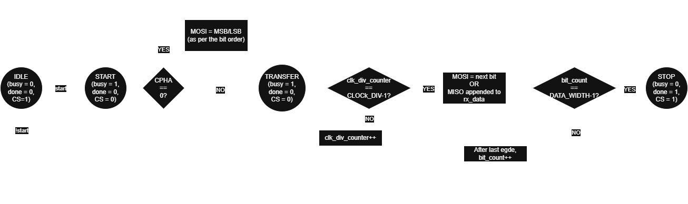
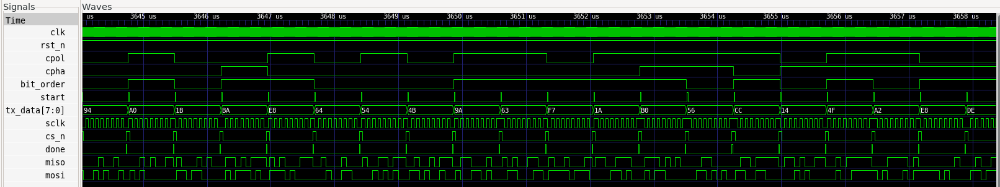

# SPI SV Core Implementation

## 1. Overview

This document describes the implementation details of the SPI SV Core.

It complements the project specification and architecture documents by documenting the RTL organization, coding style, implementation decisions, design trade-offs, synthesis results, and timing analysis throughout the development of the project.

---

## 2. Coding Guidelines

The SPI SV Core follows the implementation guidelines below:

- SystemVerilog is used throughout the project.
- Only synthesizable RTL constructs are used.
- Sequential logic is implemented using `always_ff`.
- Combinational logic is implemented using `always_comb`.
- Non-blocking assignments (`<=`) are used for sequential logic.
- Blocking assignments (`=`) are used for combinational logic.
- Enumerated types are used for finite-state machines where applicable.
- Parameters are validated during elaboration whenever possible.
- The design operates entirely within a single clock domain.
- Clock-enable signals are preferred over internally generated clocks where applicable.
- The design is fully parameterized wherever practical.

---

# 3. SPI Master

## 3.1 Module Overview

The `spi_master` module implements a synthesizable, parameterized SPI Master supporting full-duplex serial communication.

The design supports all four standard SPI operating modes through runtime-configurable clock polarity (`CPOL`) and clock phase (`CPHA`), runtime-selectable MSB-first and LSB-first transmission, parameterized transfer widths, and a parameterized clock divider for generating the SPI serial clock.

The implementation follows a synchronous single-clock architecture. All sequential logic operates on the rising edge of the system clock, while SPI protocol events are generated using internal edge-detection logic derived from the generated serial clock. Runtime configuration inputs are latched at the start of each transaction and remain unchanged until the transfer completes.

The module is fully synthesizable and vendor-independent, making it suitable for both FPGA and ASIC implementation flows.

## 3.2 Interface

### Parameters

| Parameter | Description |
|-----------|-------------|
| `DATA_WIDTH` | Number of bits transferred during each SPI transaction. |
| `CLOCK_DIV` | System-clock divider used to generate the SPI serial clock. |

### Inputs

| Signal | Width | Description |
|--------|------:|-------------|
| `clk` | 1 | System clock |
| `rst_n` | 1 | Active-low synchronous reset |
| `start` | 1 | Initiates a new SPI transaction |
| `tx_data` | `DATA_WIDTH` | Parallel transmit data |
| `miso` | 1 | Master In Slave Out |
| `cpol` | 1 | Runtime clock polarity selection |
| `cpha` | 1 | Runtime clock phase selection |
| `bit_order` | 1 | Runtime bit-order selection |

### Outputs

| Signal | Width | Description |
|--------|------:|-------------|
| `mosi` | 1 | Master Out Slave In |
| `sclk` | 1 | Generated SPI serial clock |
| `cs_n` | 1 | Active-low chip-select |
| `rx_data` | `DATA_WIDTH` | Received parallel data |
| `busy` | 1 | Indicates an active transaction |
| `done` | 1 | One-cycle transfer-complete pulse |

## 3.3 Derived Parameters

The SPI Master derives internal parameters from the user-specified configuration to simplify counter sizing while maintaining parameterized scalability.

| Parameter | Purpose |
|-----------|---------|
| `DIV_WIDTH` | Width of the SPI clock-divider counter, derived from `CLOCK_DIV`. |
| `BIT_CNT_WIDTH` | Width of the transfer bit counter, derived from `DATA_WIDTH`. |

The implementation validates the following parameter constraints during simulation:

- `DATA_WIDTH > 0`
- `CLOCK_DIV > 1`

Parameter validation is excluded from synthesis using `translate_off` directives while remaining active during simulation.

## 3.4 Internal Registers

The SPI Master maintains internal registers for runtime configuration, datapath operation, transaction control, and registered outputs.

| Register | Purpose |
|----------|---------|
| `cpol_reg` | Latched clock polarity for the current transaction. |
| `cpha_reg` | Latched clock phase for the current transaction. |
| `bit_order_reg` | Latched bit-order selection. |
| `tx_shift_reg` | Holds transmit data during serial shifting. |
| `rx_shift_reg` | Accumulates received serial data during a transaction. |
| `rx_data_reg` | Stores the completed received data after the transaction finishes. |
| `clk_div_counter` | Divides the system clock to generate the SPI serial clock. |
| `bit_count` | Tracks the number of transferred bits. |
| `mosi_reg` | Registered MOSI output. |
| `sclk_reg` | Registered SPI serial clock output. |
| `cs_n_reg` | Registered chip-select output. |
| `busy_reg` | Registered busy status. |
| `done_reg` | Registered transfer-complete indication. |

## 3.5 Combinational Signals

The SPI Master derives several combinational signals to simplify protocol implementation and reduce duplicated logic.

| Signal | Purpose |
|---------|---------|
| `toggle_now` | Indicates that the clock-divider counter has reached the programmed divide value. |
| `sclk_toggle` | Requests toggling of the generated SPI clock. |
| `sclk_rise` | Indicates a rising edge of the generated SPI clock. |
| `sclk_fall` | Indicates a falling edge of the generated SPI clock. |
| `sample_edge` | Indicates the SPI clock edge used for data sampling. |
| `shift_edge` | Indicates the SPI clock edge used for data shifting. |
| `transfer_finish` | Indicates that the final bit of the current transaction is being transferred. |
| `final_edge` | Indicates the final protocol event required to complete the transaction based on the selected SPI mode. |

The `sample_edge` and `shift_edge` signals are derived from the latched `CPOL` and `CPHA` configuration, allowing a single implementation to support all four SPI operating modes without duplicating datapath logic.

## 3.6 Datapath & State Machine

The SPI Master datapath consists of:

- Clock divider
- Edge generation logic
- Transaction FSM
- Transmit shift register
- Receive shift register
- Bit counter
- Registered outputs

The SPI Master uses a four-state finite-state machine.

| State | Function |
|--------|----------|
| `IDLE` | Waits for a new transaction |
| `START` | Initializes the transaction and latches the runtime configuration |
| `TRANSFER` | Performs full-duplex serial communication |
| `STOP` | Completes the transaction and returns to `IDLE` |

## 3.7 Algorithm

1. Validate configuration parameters.
2. Wait for a valid `start` request.
3. Latch the runtime configuration and transmit data.
4. Initialize internal registers and counters.
5. Assert `cs_n` and generate the SPI clock.
6. Shift transmit data and sample receive data according to the selected SPI mode.
7. Repeat until all bits have been transferred.
8. Store the received data.
9. Deassert `cs_n`.
10. Generate the transfer-complete indication.

## 3.8 Design Decisions

- Runtime configuration latched per transaction.
- Single clock domain.
- Parameterized SPI clock divider.
- Edge-based SPI protocol abstraction.
- Independent transmit and receive shift registers.
- Registered interface outputs.
- Runtime-selectable bit ordering.
- Compile-time parameter validation.

## 3.9 Corner Cases

| Condition | Behaviour |
|-----------|-----------|
| Invalid parameters | Simulation-time parameter validation failure |
| `start` while busy | Request ignored |
| Configuration change during transfer | Current transaction unaffected |
| `CPHA = 0` | First transmit bit preloaded |
| Reset | Controller returns to IDLE and clears internal registers |

## 3.10 Resource Utilization

### Synthesis Results

- Tool: Yosys
- Script: `scripts/synth_spi_master.ys`

| Metric | Value |
|--------|------:|
| Number of Ports | 14 |
| Number of Port Bits | 28 |
| Number of Wires | 158 |
| Number of Wire Bits | 395 |
| Public Wires | 47 |
| Public Wire Bits | 111 |
| Memory Blocks | 0 |
| Total Cells | 306 |

### Cell Breakdown

| Cell Type       | Count |
| --------------- | ----: |
| `$_AND_`        |    57 |
| `$_MUX_`        |   127 |
| `$_NOT_`        |    24 |
| `$_OR_`         |    56 |
| `$_SDFFE_PN0N_` |     3 |
| `$_SDFFE_PN0P_` |    35 |
| `$_SDFFE_PN1P_` |     1 |
| `$_XOR_`        |     3 |

### Waveform

### Verification Status

- [x] RTL Simulation
- [x] Self-checking Testbench
- [x] Assertions
- [x] Generic Synthesis
- [ ] Static Timing Analysis

---

# 4. SPI Slave

## 4.1 Module Overview

*To be completed.*

---

## 4.2 Interface

### Parameters

*To be completed.*

### Inputs

*To be completed.*

### Outputs

*To be completed.*

---

## 4.3 Derived Parameters

*To be completed.*

---

## 4.4 Internal Registers

*To be completed.*

---

## 4.5 Combinational Signals

*To be completed.*

---

## 4.6 Datapath & State Machine

*To be completed.*

---

## 4.7 Algorithm

*To be completed.*

---

## 4.8 Design Decisions

*To be completed.*

---

## 4.9 Corner Cases

*To be completed.*

---

## 4.10 Resource Utilization

### Synthesis Results

*To be completed.*

### Cell Breakdown

*To be completed.*

### Waveform

*To be completed.*

### Verification Status

- [ ] RTL Simulation
- [ ] Self-checking Testbench
- [ ] Assertions
- [ ] Generic Synthesis
- [ ] Sky130 Technology Mapping
- [ ] Static Timing Analysis

---

# 5. SPI Top-Level

## 5.1 Module Overview

*To be completed.*

## 5.2 Interface

### Parameters

*To be completed.*

### Inputs

*To be completed.*

### Outputs

*To be completed.*

---

## 5.3 Internal Signals

*To be completed.*

---

## 5.4 Datapath & Hierarchy

*To be completed.*

---

## 5.5 Algorithm

*To be completed.*

---

## 5.6 Design Decisions

*To be completed.*

---

## 5.7 Corner Cases

*To be completed.*

---

## 5.8 Resource Utilization

### Synthesis Results

*To be completed.*

### Cell Breakdown

*To be completed.*

### Waveform

*To be completed.*

### Verification Status

- [ ] RTL Simulation
- [ ] Self-checking Testbench
- [ ] Assertions
- [ ] Generic Synthesis
- [ ] Sky130 Technology Mapping
- [ ] Static Timing Analysis

---

# 6. Technology Mapped Synthesis

*To be completed after RTL implementation.*

---

# 7. Static Timing Analysis

*To be completed after synthesis.*

---

# 8. Summary

*To be completed after implementation.*

---

# 9. Future Improvements

Future versions of the SPI SV Core may include:

- Multi-chip-select SPI Master
- Multi-slave controller
- Multi-master arbitration
- Runtime-programmable clock divider
- FIFOs
- DMA support
- Interrupt generation
- APB wrapper
- AXI4-Lite wrapper
- Quad SPI (QSPI)
- Execute-In-Place (XIP)
- Formal verification